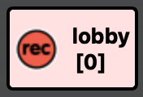
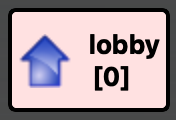
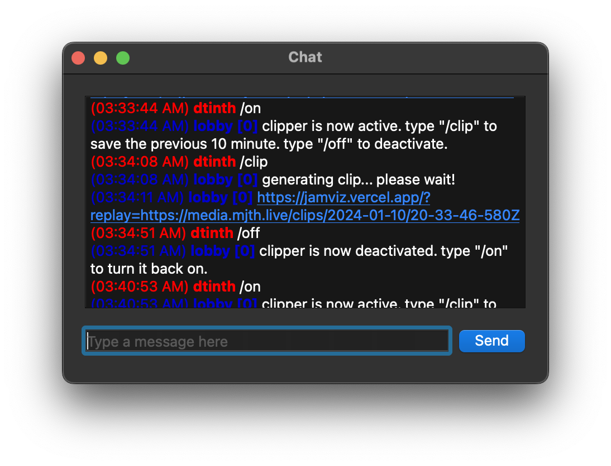

# ระบบบันทึกเสียงย้อนหลังในเซิร์ฟเวอร์ MJTH

เซิร์ฟเวอร์ MJTH.live มีระบบบันทึกเสียงย้อนหลัง โดยสามารถควบคุมในโปรแกรม Jamulus ได้เลย

- **สามารถเปิด/ปิด ได้** ผ่านการพิมพ์คำสั่งในแชทของ Jamulus
- ระหว่างที่ระบบบันทึกเสียงย้อนหลังทำงานอยู่ ระบบจะอัดเสียงภายในเซิร์ฟเวอร์อย่างต่อเนื่อง โดยจะเก็บเสียงแค่ 10 นาทีล่าสุดไว้ ผู้ใช้งานสามารถสั่งให้บันทึกคลิปเสียงออกมาได้ โดยการพิมพ์คำสั่งในแชทของ Jamulus

## ตรวจสอบสถานะระบบบันทึกเสียงย้อนหลัง

สามารถตรวจสอบสถานะได้ในโปรแกรม Jamulus โดยสังเกตที่สัญลักษณ์ข้างๆ ชื่อของตัว lobby

|       สัญลักษณ์ Recorder        |        สัญลักษณ์ Streamer        |
| :-----------------------------: | :------------------------------: |
|   |  |
| ระบบบันทึกเสียงย้อนหลังเปิดอยู่ |  ระบบบันทึกเสียงย้อนหลังปิดอยู่  |

## การใช้งานระบบบันทึกเสียงย้อนหลัง

สามารถควบคุมระบบบันทึกเสียงย้อนหลังได้ผ่านการพิมพ์คำสั่งในแชทของ Jamulus:

| คำสั่ง  | คำอธิบาย                    |
| ------- | --------------------------- |
| `/on`   | เปิดระบบบันทึกเสียงย้อนหลัง |
| `/clip` | บันทึกคลิปเสียง             |
| `/off`  | ปิดระบบบันทึกเสียงย้อนหลัง  |

### `/on`

- เมื่อสั่ง `/on` แล้ว ระบบจะเริ่มอัดเสียงอย่างต่อเนื่อง จนกว่าจะถูกสั่งให้ปิด
- สามารถเปิดทิ้งไว้ได้ **โดยระบบจะเก็บแค่เสียงใน 10 นาทีล่าสุดเท่านั้น** หมดปัญหา“รู้งี้อัดเก็บไว้ดีกว่า”
- ระบบจะบันทึกเสียงเป็นแบบ single-track (เสียงทุกคนจะถูกมิกซ์รวมกัน) โดยระดับเสียงของแต่ละคนจะเท่ากันหมด (เช่นเดียวกับที่ฟังผ่านเว็บ [lobby.mjth.live](https://lobby.mjth.live))

### `/clip`

- เมื่อสั่ง `/clip` แล้ว ระบบจะทำการบันทึกคลิปเสียงออกมา แล้วส่งลิงก์คลิปเสียงผ่านทางกล่องแชทของ Jamulus ([ดูตัวอย่าง](https://jamviz.vercel.app/?replay=https://media.mjth.live/clips/2024-01-10/20-44-27-688Z))
- เมื่อเข้าไปที่ลิงค์ สามารถคลิกขวาที่ตัวเล่นเสียง แล้วเลือก “Save Audio As…” เพื่อบันทึกคลิปเสียงลงในเครื่องได้
- กรุณาดาวน์โหลดคลิปเสียงที่ได้ไว้ในเครื่องตัวเองภายใน 7 วัน หลังจากนั้นคลิปเสียงอาจจะถูกลบออกจากระบบ

### `/off`

- เมื่อสั่ง `/off` แล้ว ระบบจะหยุดการอัดเสียง และลบเสียงที่ยังไม่ได้บันทึกไว้ออกไป
- หากต้องการบันทึกคลิปเสียง กรุณาสั่ง `/clip` ก่อนสั่ง `/off`
- สามารถปิดระบบบันทึกเสียงย้อนหลังได้หากต้องการความเป็นส่วนตัว (อย่างไรก็ตาม คนอื่นๆ ที่อยู่ในเซิร์ฟเวอร์ รวมถึงผู้ฟังผ่านหน้าเว็บ lobby อาจจะสามารถบันทึกเสียงได้ด้วยวิธีอื่นๆ)

## ภาพตัวอย่างการใช้งาน

